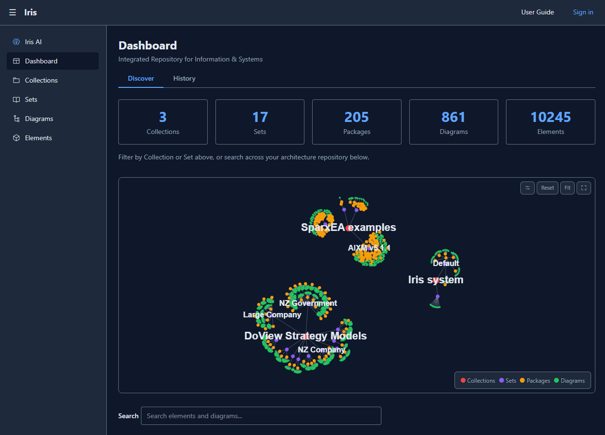

# Iris

**Integrated Repository for Information & Systems**

Iris is a web-based architectural modelling tool for creating, managing, and versioning architectural entities, relationships, and views. It supports Simple, UML, ArchiMate, C4, DoView, Markdown, and BPMN 2.0 (preview) notations with full keyboard accessibility and WCAG 2.2 Level AA compliance. The same capabilities are exposed over a public HTTP API, an `iris` CLI, and an `iris-mcp` MCP server, so humans, scripts, and AI agents all drive Iris with the same auth and tooling.



## Architecture

Iris follows a **repository-first architecture** (ADR-003): entities are first-class citizens stored in a versioned repository. Diagrams are projections of entity data, not the source of truth.

```
iris/
  backend/       Python/FastAPI API server
  frontend/      SvelteKit/Svelte 5 single-page application
  iris-client/   Shared async Python HTTP client (ADR-132)
  cli/           `iris` command-line tool (ADR-130)
  mcp/           `iris-mcp` stdio MCP server for AI agents (ADR-131)
  extensions/    Extension source registry (sources.json, manifest.json)
  docs/          ADRs, specs, protocols, and compliance documents
  render.yaml    Render Blueprint (optional cloud deployment)
```

### Deployment modes

| Mode | Database | Auth | Hosting |
|------|----------|------|---------|
| **SQLite** (default) | SQLite (aiosqlite) | Iris JWT (Argon2id) | Self-hosted (any server) |
| **Supabase** (optional) | PostgreSQL (asyncpg) | Supabase Auth (JWTs) | Render (3 static sites + web service) |

The default self-hosted mode requires no external services. The optional Render + Supabase mode deploys `iris-api`, `iris-frontend`, and the optional `scenia-frontend` static site. See [docs/deployment-render-supabase.md](docs/deployment-render-supabase.md) for setup instructions.

### Backend

- **Framework:** FastAPI with async database access (aiosqlite / asyncpg)
- **Database:** SQLite with WAL mode (default) or PostgreSQL via Supabase (optional)
- **Auth:** Argon2id password hashing + Iris JWT (SQLite) or Supabase Auth JWT (Supabase)
- **RBAC:** 4 roles (Admin, Architect, Reviewer, Viewer) with 26 permission mappings
- **Audit:** SHA-256 hash-chained immutable audit log (separate DB in SQLite; table in Supabase)
- **Versioning:** Immutable append-only entity versions with revert-as-new-version rollback
- **Search:** Full-text search with SQLite FTS5 (default) or PostgreSQL tsvector/GIN (Supabase)

### Frontend

- **Framework:** SvelteKit with Svelte 5 (runes: `$state`, `$derived`, `$effect`, `$props`)
- **Canvas:** @xyflow/svelte (SvelteFlow) for interactive diagram editing
- **Styling:** Tailwind CSS v4 with CSS custom properties for theming
- **Accessibility:** WCAG 2.2 Level AA + adopted AAA (2.4.13 Focus Appearance, 2.1.3 Keyboard No Exception)
- **Security:** DOMPurify sanitisation on all user-generated content rendered in canvas

## Features

### Canvas Views

| View | Entity Types | Relationship Types |
|------|-------------|-------------------|
| **Simple** | Component, Service, Interface, Package, Actor, Database, Queue, Note, Boundary | Uses, Depends On, Composes, Implements, Contains |
| **UML** | Class, Object, Use Case, State, Activity, Deployment | Association, Aggregation, Composition, Dependency, Realization, Generalization |
| **ArchiMate** | 11 types across Business, Application, Technology layers | Serving, Composition, Aggregation, Assignment, Realization, Access, Influence, Triggering |
| **C4** | Person, Software System, Container, Component, Code Element, Deployment Node, Infrastructure Node | Uses, Depends On, Contains |
| **DoView** | Outcome Box, Final Outcome, Overview Tile, Source Reference | Causal Link |
| **Markdown (Text)** | Markdown source rendered as a document; cross-links via the `iris://diagram/<id>` and `iris://element/<id>` URL scheme | TOC drawer with depth-indented headings; in-editor toolbar (B / I / H1–H3 / lists / quote / code / link / image / hr) and Ctrl+B / Ctrl+I / Ctrl+K shortcuts; clipboard image paste |
| **BPMN 2.0** *(preview, WIP)* | 14 base types across Activities, Events, Gateways, Swimlanes, Data, Artifacts via discriminator fields | Sequence Flow (default + conditional), Message Flow, Association, Data Association |
| **Sequence** *(UML diagram type)* | Participants with lifelines | Sync, Async, Reply messages with activation boxes |

### Keyboard Accessibility

All canvas operations have keyboard equivalents:

| Key | Action |
|-----|--------|
| Tab / Shift+Tab | Navigate between entities |
| Arrow keys | Move selected entity (Shift = large steps) |
| Ctrl+N | Create new entity |
| C | Toggle connect mode |
| Enter / Space | Select / confirm |
| Delete | Delete selected entity |
| Escape | Deselect / cancel |
| Ctrl+= / Ctrl+- | Zoom in / out |
| Ctrl+0 | Fit to screen |
| F | Focus selected entity |

### Theming

Four colour modes with WCAG-compliant contrast ratios:

- **Light** — Default theme
- **Dark** — Dark background with light text
- **High Contrast** — Black background, yellow primary, 7:1+ ratios
- **System** — Follows OS preference via `prefers-color-scheme`

### Anonymous Browsing

Visitors can browse every collection, set, package, view, element, knowledge graph, and run searches without signing in. Ask AI is available anonymously with a stricter per-IP rate limit. Writes and admin routes remain authenticated.

### In-App User Guide

A hand-written user guide at `/guide` covers every user-facing capability across 16 sections — Getting Started, Dashboard, Collections & Sets, Packages & Views, Notations, Canvas Editing, Knowledge Graph, Search, Ask AI, Comments, Imports & Data, Roadmap (Scenia), Bookmarks, Themes & Accessibility, Keyboard Shortcuts, and Admin. Sign-in-only material is called out inline. Available to anonymous visitors.

### Canvas Interaction

- **Edit Mode** — Full canvas editing with drag, connect, create, delete
- **Browse Mode** — Read-only canvas for viewers and reviewers, click node to show entity detail panel
- **Focus View** — Fullscreen overlay for distraction-free canvas work (all notations), Escape to exit
- **Relationship Dialog** — When connecting two entities, a dialog prompts for relationship type and optional label
- **Link Existing Entity** — Add entities from the repository to the canvas via searchable picker dialog
- **Notation Routing** — View notation determines which canvas renders: Simple, UML, ArchiMate, C4, DoView, BPMN, Markdown (Text), or Sequence
- **Sequence Editing** — Add/remove participants and messages, zoom/pan/fit-to-view via SVG viewBox

### Dashboard

- Entity and view counts with linked navigation
- Bookmarked views with quick access
- Full-text search across entities and views
- **Knowledge graph** — interactive force-directed graph showing elements, views, and packages as colour-coded nodes for the active set/collection, with all relationship types (entity, view, package, hierarchy), click-to-navigate, drag-to-rearrange, zoom/pan, and theme-aware rendering. Settings panel toggles each node/edge type and exposes physics sliders (label density, node spacing, size contrast, link length); admins can set defaults per global/collection/set scope
- Quick navigation cards for key sections

### Admin Panel

- **User Management** — List, create, edit role, activate/deactivate users with WCAG-compliant forms and confirmation dialogs
- **Audit Log** — Paginated audit log viewer with action/username/target/date range filters, chain verification badge, and expandable row detail (JSON rendered as text, no `{@html}`)
- **System Notification Banner** — admins post a site-wide message that renders as a sticky top strip on every page for every visitor (anonymous included); dismissible per-message per-browser-session
- **Extension Manager** — install / enable / disable optional integrations (Scenia, MNEMOS, DocRef); for GitHub-sourced extensions, the page surfaces installed-vs-latest version, an "Update available" pill, and per-row Check for updates / Upgrade actions backed by a daily auto-scanner workflow

### Views Gallery

- Toggle between list view (compact single-line items) and gallery view (detailed cards)
- Gallery cards show static SVG preview thumbnails of views (canvas nodes/edges, sequence participants/lifelines)
- Responsive CSS grid cards show thumbnail, name, type, full description, and updated date
- Card size slider (200px–400px) adjusts card width in gallery mode
- View mode and card size persist in localStorage across sessions

### Collections & Sets

- **Collections** — optional higher-level grouping for Sets; a Set can belong to one Collection for cross-set organisation and filtering
- **Collection-scoped filtering** — Collection dropdown on Views, Elements, and Ask AI pages cascades to filter available Sets
- **Multi-set AI context** — Ask AI supports selecting multiple Sets (with or without a Collection) as context for Q&A and diagram creation
- **Package-level and view-level scoping** — narrow AI context below the set granularity to a specific package or a single view + its elements
- **AI "Create Diagram" across five notations** — the guided creation flow (ADR-094 / ADR-132) supports DoView (outcomes_map, overview), Simple (component, roadmap, free-form), UML (sequence, class), ArchiMate (process), and C4 (deployment). Pick a notation and (for non-DoView) a diagram type; the AI walks through setup questions, structure confirmation, content confirmation, then generates end-to-end
- **Session file upload** — Upload PDF, DOCX, XLSX, PPTX, CSV, or text files on the Ask AI Context tab as ephemeral AI context (extracted text, not stored)
- **Per-conversation model selector + advanced parameters** — pick which provider/model to use per chat from the toolbar; admin AI provider config exposes `top_p`, `top_k`, `min_p`, `frequency_penalty`, `presence_penalty`, and stop sequences (provider-aware — unsupported parameters are silently omitted)
- **Sets** — top-level workspace grouping; each view and entity belongs to exactly one set (like folders, not labels)
- **Default Set** — all existing items belong to the Default set; it cannot be deleted
- **Set-scoped Tags** — tags are independent per set; "v1.0" in Set A is isolated from "v1.0" in Set B
- **Auto-membership** — saving a view's canvas automatically moves referenced entities into the view's set
- **Set Selector** — dropdown on views, entities, and import pages for filtering and assignment

### Batch Operations

- Select mode toggle on views and entities list pages with checkboxes on each item
- Batch toolbar with Clone, Move to Set, Tags, and Delete actions (up to 100 items per request)
- Batch set dialog for moving items between sets
- Batch tag dialog for adding/removing tags across multiple items

### Pagination

- Page size selector (25, 50, 100 items per page) on views and entities list pages
- Previous/Next navigation with page number links
- Total items count display

### Entity & View Management

- Inline "Edit Metadata" on view and entity detail pages — in-place editing of Name, Description, Tags (replaces popup dialogs)
- View and entity detail pages with accordion layout (Summary, Details, Extended groups)
- Entity clone button on detail page
- Extended metadata display for imported entities (scope, abstract, persistence, author, dates, tagged values)
- View relationships: inter-view dependency tracking with dedicated Relationships tab, create from tab or canvas
- Unified relationship management: create entity and view relationships from Relationships tab with "Add to canvas?" prompt
- Canvas viewref-to-viewref connections auto-create backend view relationships
- Node removal dialog: "Remove from this view" or "Delete entity and all relationships" (cascade deletion)
- **`iris://` URL scheme** — `iris://diagram/<id>`, `iris://element/<id>`, and `iris://package/<id>` resolve to in-app navigation; used by Markdown views, AI-emitted answers, and the MCP server's `web_url` field
- SparxEA import (.qea and .eap): full coverage — Note/Boundary elements, NoteLink connectors, self-references, Package-to-Package dependencies as view relationships
- DoView PPTX import (.pptx, single or bulk): structural compliance validation, shape classification, column-based causal link inference, cross-view navigation, colour preservation
- ArchiMate Open Exchange XML import (.xml, .archimate, .oex): full element + relationship + view import for ArchiMate 3.0 / 3.1 / 3.2 (The Open Group standard exchange format). Auto-generates an Overview diagram with type-grouped grid layout when the source file has no embedded views.
- DocRef legislation import (optional extension): import NZ legislation documents from legislation.docref.nz as AI context, browse and import chunked CSVs with progress, async fire-and-forget so long imports don't time out at the edge
- Import change summary in version history ("Imported from SparxEA" / "Imported from DoView PPTX")
- Entity CRUD with optimistic concurrency via If-Match headers
- View CRUD with notation filter on list page (Simple, UML, ArchiMate, C4, DoView, Markdown, BPMN, Sequence)
- Bookmark toggle on view detail page (and on element detail pages)
- Comments on view and entity detail pages (add, edit, delete)
- Version rollback on view detail Version History tab (revert-as-new-version)
- Password change on Settings page with NZISM-compliant validation

### Statistics & Cross-References

- Entity relationship counts and view usage statistics
- Entity-to-view cross-reference queries (which views reference an entity)

### Extensions

Iris supports optional integrations via a database-backed extensions registry. Install / enable / disable from **Admin > Settings > Extensions**. Each extension declares a `source_method` (github / npm / local) and source URL in the shared `extensions/sources.json` registry; for GitHub-sourced extensions, a daily workflow polls the releases API and opens a deduplicated upgrade issue when a newer version ships, with one-click upgrade from the admin UI.

#### Scenia Roadmapping

Integrates [Scenia](https://github.com/waylonkenning/Scenia), an open-source roadmapping tool. When installed:

- **Full Scenia UI** — the complete React-based roadmapping app is embedded at `/scenia`, backed by Iris's database instead of IndexedDB
- **Roadmap data view** — Iris-native tabular view at `/roadmap` showing all entities with "View in Scenia" links
- **Demo data** — installing the extension seeds a "Scenia Extract" set with 150+ entities (40 assets incl. GEANZ catalog, 40 initiatives, 6 programmes, 6 strategies) and 10 interlinked diagrams
- **Cross-links** — Scenia elements show "View in Scenia" buttons in element detail pages; the Scenia app includes "View in Iris" links
- **Extension gating** — all Scenia API endpoints return 404 when the extension is not installed or disabled
- **Cloud deployment** — when running Render+Supabase, Scenia ships as a third static site (`scenia-frontend`)

#### MNEMOS Semantic Retrieval

Optional [MNEMOSv2](https://github.com/ro0TuX777/MNEMOSv2) integration providing AI-powered semantic context retrieval, replacing naive token-budget truncation with question-aware ranking across sets. Pluggable `RetrievalPort` abstraction means Iris falls back gracefully to direct retrieval when MNEMOS is unavailable. Self-hosted Docker only (Render's managed dynos can't run docker-in-docker).

#### DocRef Legislation

Optional integration for importing NZ legislation documents from legislation.docref.nz as AI context. Imported documents appear alongside sets and collections on the Ask AI page; an hourly background workflow refreshes the catalogue.

## Agentic AI, CLI, and public API

The same capabilities are exposed across three surfaces so humans,
scripts, and AI agents can all use Iris as a first-class resource
(ADR-127 through ADR-134).

### Personal Access Tokens

Any authenticated user can mint long-lived revocable `iris_pat_…`
bearer tokens for CLI / MCP / agent use from `/api/users/me/tokens`.
Tokens inherit the creating user's role, are Argon2id-hashed, and the
plaintext value is returned exactly once. PATs and JWTs share the
`Authorization: Bearer …` header so no client changes are needed to
switch between them. Per-auth-type rate-limit buckets
(`login` / `refresh` / `anon` / `anon_ai` / `pat` / `general`) ensure
a busy CLI user can't starve browser traffic.

### Public HTTP API

Full OpenAPI docs live at **`/api/docs`** (Swagger UI) and
**`/api/openapi.json`** in every environment. Authenticate with a JWT
(browser login) or a Personal Access Token. Many read endpoints accept
anonymous callers (ADR-123). Server-side export endpoints
(`/api/export/*`) produce JSON or Markdown bundles for views,
elements, packages, sets, and collections.

```sh
# Mint a PAT for programmatic use:
curl -X POST https://iris.example.com/api/users/me/tokens \
  -H "Authorization: Bearer <JWT>" -H "Content-Type: application/json" \
  -d '{"name": "my laptop"}'

# Use it:
curl https://iris.example.com/api/search?q=payment \
  -H "Authorization: Bearer iris_pat_..."

# Headless export (JSON + Markdown supported):
curl "https://iris.example.com/api/export/diagrams/<id>?format=markdown" \
  -H "Authorization: Bearer iris_pat_..." -o overview.md
```

See [`docs/api.md`](docs/api.md) for the full reference, rate-limit
buckets, and the unversioned-path deprecation policy.

### Command-line interface

```sh
uv tool install --from ./cli iris-cli
iris login --url https://iris.example.com
iris search "payment"
iris diagrams list
iris export set <id> --format markdown -o notes.md
iris ask "Summarise the onboarding flow" --set default --stream
```

Config order: flag → env (`IRIS_URL`, `IRIS_TOKEN`) →
`~/.config/iris/config.toml` → anonymous defaults. `--json` on any
command emits machine-parsable output. See
[`cli/README.md`](cli/README.md) and [ADR-130](docs/adrs/ADR-130-CLI-Architecture.md).

### MCP server for AI agents

```sh
uv tool install --from ./mcp iris-mcp
```

Drop into Claude Desktop / Claude Code / Cursor:

```json
{
  "mcpServers": {
    "iris": {
      "command": "uvx",
      "args": ["iris-mcp"],
      "env": {
        "IRIS_URL": "https://iris.example.com",
        "IRIS_TOKEN": "iris_pat_...",
        "IRIS_WEB_URL": "https://iris.example.com"
      }
    }
  }
}
```

Exposes ~19 tools (search, list/get for every entity, export, ask-AI,
apply-diagram-creation, conversations) plus `iris://` resource URIs
for JSON export bundles. When `IRIS_WEB_URL` is set, every tool
response that carries an entity id also carries a resolved front-end
URL so MCP-using LLMs link back to the live UI without guessing
hosts. See [`mcp/README.md`](mcp/README.md) and
[ADR-131](docs/adrs/ADR-131-MCP-Server-Architecture.md).

## Getting Started

### Prerequisites

- Python 3.12+ with [uv](https://docs.astral.sh/uv/)
- Node.js 20+ with npm

### Quick Start (Dev Script)

```sh
# Start both backend and frontend
./scripts/dev.sh start

# Check status
./scripts/dev.sh status

# Stop both
./scripts/dev.sh stop

# Full restart
./scripts/dev.sh restart
```

### Manual Setup

#### Backend

```sh
cd backend
uv sync
uv run python -m app.main
```

The API server starts on `http://localhost:8000`.

#### Frontend

```sh
cd frontend
npm install
npm run dev
```

The frontend starts on `http://localhost:5173` with API proxy to the backend.

### Running Tests

```sh
# Backend pytest suite
cd backend
uv run python -m pytest

# Frontend vitest unit suite
cd frontend
npm test

# Frontend E2E tests (Playwright, scripted)
cd frontend
npm run test:e2e

# Frontend BDD tests (Gherkin feature files via playwright-bdd)
cd frontend
npm run test:bdd

# All frontend E2E tests (scripted + BDD)
cd frontend
npm run test:all-e2e

# Live UAT verification suite (drives https://iris-uat.chrisbarlow.nz
# via Playwright; requires PLAYWRIGHT_UAT=1 + a tester account)
cd frontend
npm run test:uat
```

## Compliance

### WCAG 2.2

58 criteria audited (56 AA + 2 adopted AAA). Key implementations:

- Skip links, ARIA landmarks, focus indicators (2px, 3:1 contrast)
- Keyboard navigation for all canvas operations (no keyboard traps)
- 24px minimum touch targets, reduced motion support
- Session timeout warning with extension option
- Help page with keyboard shortcut reference
- Three-theme system meeting all contrast requirements

### NZ ITSM (NZISM v3.9)

44 controls mapped across 6 families. Key implementations:

- Argon2id password hashing with 12-char minimum, complexity, and history
- JWT with 15-minute expiry and refresh token rotation
- SHA-256 hash-chained audit log in separate database
- Rate limiting (10/min login, 30/min refresh, 100/min general)
- DOMPurify XSS prevention, CSP headers, parameterised queries
- RBAC with least privilege (4 roles, 26 permission mappings)
- Row Level Security on all Supabase tables (deny-all, no direct REST API access)

## Documentation

| Document | Purpose |
|----------|---------|
| `/guide` (running app) | Hand-written 16-section in-app user guide for every user-facing capability |
| `docs/north-star.md` | Vision, principles, and success criteria |
| `docs/protocols.md` | 12 non-negotiable development protocols |
| `docs/api.md` | Public HTTP API reference — auth, rate limits, deprecation policy |
| `docs/cli.md` | `iris` command-line reference |
| `docs/mcp.md` | `iris-mcp` MCP server for AI agents |
| `docs/adrs/` | 140+ Architecture Decision Records (latest: ADR-148) |
| `docs/adrs/specs/` | 160+ implementation specifications |
| `docs/deployment-render-supabase.md` | Render + Supabase deployment guide |
| `docs/ROADMAP.md` | Future enhancements and semantic search roadmap |
| `docs/nz-itsm-control-mapping.md` | NZISM control compliance tracking |
| `CHANGELOG.md` | Per-release notes (Keep a Changelog format, semver) |

## Technology Stack

| Layer | Technology | Version |
|-------|-----------|---------|
| Frontend Framework | SvelteKit | 2.x |
| UI Framework | Svelte 5 | 5.x (runes) |
| Canvas | @xyflow/svelte | 1.5.x |
| Styling | Tailwind CSS | 4.x |
| Backend Framework | FastAPI | 0.115.x |
| Database (default) | SQLite | 3.x (aiosqlite) |
| Database (Supabase mode) | PostgreSQL | asyncpg |
| Auth Hashing | Argon2id | argon2-cffi |
| JWT | python-jose | HS256 |
| MCP Server | iris-mcp | 5.6.x (stdio) |
| Testing (Backend) | pytest | 8.x |
| Testing (Frontend Unit) | Vitest | 4.x |
| Testing (Frontend E2E) | Playwright | 1.58.x |
| Testing (Frontend BDD) | playwright-bdd | 8.4.x |
| Linting | Ruff | 0.9.x |
| Type Checking | mypy (strict) | 1.x |

## Contributing

Bugs and feature requests are tracked via [GitHub Issues](https://github.com/cgbarlow/iris/issues). See [CONTRIBUTING.md](CONTRIBUTING.md) for details.

## License

Licensed under the [Apache License 2.0](LICENSE).
