# Recording Architecture Decisions

*"We will keep a collection of records for "architecturally significant" decisions: those that affect the structure, non-functional characteristics, dependencies, interfaces, or construction techniques." -* **Michael Nygard**

[https://www.cognitect.com/blog/2011/11/15/documenting-architecture-decisions](https://www.cognitect.com/blog/2011/11/15/documenting-architecture-decisions)

# What is an ADR?

[https://github.com/joelparkerhenderson/architecture_decision_record](https://github.com/joelparkerhenderson/architecture_decision_record)

Extract:

What is an architecture decision record?

- An architecture decision record (ADR) is a document that captures an important architectural decision made along with its context and consequences.

- An architecture decision (AD) is a (software) design choice that addresses a significant requirement.

- An architecture decision log (ADL) is the collection of all ADRs created and maintained for a particular project (or organization).

- An architecturally-significant requirement (ASR) is a requirement that has a measurable effect on a (software) system's architecture.

- All these are within the topic of architecture knowledge management (AKM).

# Why write ADRs

[https://github.blog/2020-08-13-why-write-adrs/](https://github.blog/2020-08-13-why-write-adrs/)

Extract:

Architecture decision records, also known as ADRs, are a great way to document how and why a decision was reached.

- They're not for you, they're for future you

- They're not for you, they're for your peers

- They're not for you, they're for your future peers

# ADR Minimalism: Keeping Decisions Lean

## The Principle

ADRs should capture the **decision** and its **rationale**, not the detailed implementation. An ADR answers "what did we decide and why?" — it should not attempt to answer "how exactly do we implement this?"

When ADRs become bloated with implementation details, they suffer from several problems: they become difficult to maintain, the decision rationale gets buried in technical noise, and updates to implementation details require changes to what should be a stable historical record.

## Separating Decisions from Specifications

Specifications — the detailed technical designs, API contracts, data models, configuration standards, and implementation guides — should exist as **separate artefacts** referenced by the ADR, not embedded within it.

```mermaid
flowchart LR
    subgraph ADR["🗂️ ADR-042: API Gateway Pattern"]
        direction TB
        What["What: Kong as API Gateway"]
        Why["Why: Cloud-native, plugin ecosystem"]
        Refs["📎 References"]
    end
    
    subgraph Specs["Referenced Specifications"]
        direction TB
        S1["📄 SPEC-042-A<br/>Gateway Configuration Standard"]
        S2["📄 SPEC-042-B<br/>Authentication Flow Design"]
        S3["📄 SPEC-042-C<br/>Rate Limiting Policy"]
    end
    
    Refs --> S1
    Refs --> S2
    Refs --> S3
```

### What belongs in an ADR

- The decision statement (what was decided)
- Context and problem being solved
- Options considered and why alternatives were rejected
- Expected benefits and accepted trade-offs
- Governance and status metadata
- **References** to detailed specifications

### What belongs in a Specification

- Detailed technical designs and diagrams
- API contracts and interface definitions
- Data models and schemas
- Configuration standards and templates
- Implementation patterns and code examples
- Step-by-step procedures

### Benefits of Separation

| Concern | ADR | Specification |
| ------- | --- | ------------- |
| **Stability** | Should rarely change once approved | Expected to evolve with implementation |
| **Audience** | Decision-makers, architects, future teams | Implementers, developers, operators |
| **Versioning** | Immutable record (superseded, not edited) | Living document with version history |
| **Review cycle** | Architecture governance boards | Technical review within teams |
| **Granularity** | One decision per ADR | Multiple specs may support one ADR |

### Reference Pattern

Include a **References** section in your ADR that links to supporting specifications:

| Reference ID | Title | Type | Location |
| ------------ | ----- | ---- | -------- |
| SPEC-042-A | API Gateway Configuration Standard | Technical Specification | `/docs/specs/SPEC-042-A.md` |
| SPEC-042-B | Authentication Flow Design | Design Document | `/docs/specs/SPEC-042-B.md` |
| SPEC-042-C | Rate Limiting Policy | Policy Document | `/docs/policies/rate-limiting.md` |

# Architecture Decision Record (ADR) format recommendations

## WH(Y) statement

[https://www.ozimmer.ch/practices/2020/04/27/ArchitectureDecisionMaking.html](https://www.ozimmer.ch/practices/2020/04/27/ArchitectureDecisionMaking.html)

Extract:

In the **context** of the Web shop service,  
**facing** the need to keep user session data consistent and current across shop instances,  
we **decided** for the Database Session State Pattern  
and **neglected** Client Session State or Server Session State  
to **achieve** cloud elasticity,  
**accepting** that a session database needs to be designed, implemented, and replicated.

Each template element appears on one line in the above example:

1. ***context***: functional requirement (user story or use case) or an architecture component,

2. ***facing***: non-functional requirement, for instance a desired quality,

3. ***we decided for***: decision outcome, arguably the most important part,

4. ***and neglected***: alternatives not chosen (not to be forgotten!),

5. ***to achieve***: benefits, the full or partial satisfaction of the requirement,

6. ***accepting that***: drawbacks, impact on other properties/context and effort/cost.

Its six sections form one (rather long) sentence and can be visualized with the letter "Y", pronounced just like the word "why", which explains the name of the template:

```mermaid
flowchart TB
    UC["🎯 In the context of<br/><use case uc and/or component co>"]
    NFC["⚠️ ... facing<br/><non-functional concern c>"]
    UC & NFC --> D((" "))
    D --> Options
    
    subgraph Options[" "]
        direction LR
        O1["✅ we decided for <option o1>"]
        O2["❌ and neglected <options o2 to on>"]
    end
    
    Options --> Q["🏆 ... to achieve <quality q>"]
    Q --> C["⚖️ ... accepting downside <consequence c>"]
```

 

## WHY(Y) statement - expanded

Includes **Status**, **Governance**, **Dependencies**, and other supporting information.

### Architecture Decision Record (ADR)

| Decision | Initiative ID | Proposed by | Context (1) | Facing (2) | We decided for (3) | And neglected (4) | To achieve (5) | Accepting that (6) |
| -------- | ------------- | ----------- | ----------- | ---------- | ------------------ | ----------------- | -------------- | ------------------ |
| *unique identifier* | *project reference ID* | *who wrote this record* | *functional requirement (user story or use case) or an architecture component (product, solution, system)* | *non-functional requirement, for instance a desired quality* | *decision outcome, arguably the most important part* | *alternatives or options not chosen* | *benefits, the full or partial satisfaction of the requirement* | *drawbacks, impact on other properties/context and effort/cost* |
| D123 | ITAMP456 | Joe Bloggs | `In the context of the Web shop service,` | `facing the need to keep user session data consistent and current across shop instances,` | `we decided for the Database Session State Pattern` | `and neglected Client Session State or Server Session State` | `to achieve cloud elasticity,` | `accepting that a session database needs to be designed, implemented, and replicated.` |

\+ **supporting documentation or references**.

#### ADR journal - Dependencies

The **Dependencies** metadata captures relationships between this ADR and others. This enables impact analysis, navigation, and understanding of the broader decision context.

| Relationship | Related ADR | Title | Notes |
| ------------ | ----------- | ----- | ----- |
| *Depends On / Supersedes / Relates To / Refines / Part Of (Master)* | *ADR identifier* | *Title of related ADR* | *Brief explanation of the relationship* |
| Depends On | D098 | Cloud-First Strategy | Prerequisite strategic direction |
| Relates To | D119 | Caching Strategy | Consider session caching implications |
| Part Of | MD015 | E-Commerce Platform Modernisation | Parent initiative |

#### ADR journal - References

The **References** section links to detailed specifications and supporting documentation, keeping the ADR focused on the decision while providing paths to implementation detail.

| Reference ID | Title | Type | Location | Version |
| ------------ | ----- | ---- | -------- | ------- |
| *Unique spec identifier* | *Document title* | *Specification / Design / Policy / Standard* | *Path or URL* | *Current version* |
| SPEC-D123-A | Session State Database Schema | Technical Specification | `/docs/specs/session-db-schema.md` | 1.2 |
| SPEC-D123-B | Session Replication Configuration | Configuration Standard | `/docs/standards/session-replication.md` | 1.0 |

#### ADR journal - Governance

The **Governance** metadata will change over time. Therefore these will be sub-records within a Decision record; we can expect a journal of multiple Governance records associated to a Decision record.

| Architecture design / Review board presented to? | Presentation date | Outcome of presentation | Resulting Action / Comments | Review cadence | Next Review Date |
| ------------------------------------------------ | ----------------- | ----------------------- | --------------------------- | -------------- | ---------------- |
| *Name, eg;* AC, TDC, PGG | *When was this presented* |   |   | *Frequency of review* | *Calculated based on Presentation Date and Review Cadence* |
| TDC | 01 Jun 2021 | Endorsed | Proceed to procurement stage | 12 months | 01 Jun 2022 |

#### ADR journal - Status

The **Status** metadata will change over time. Therefore these will be sub-records within a Decision record; we can expect a journal of multiple Status records associated to a Decision record.

| Status | Approver | Date |
| ------ | -------- | ---- |
| *Approved / Under review / Expired (could be automated) / Retired / Rejected / Superseded* | *Usually the Product Owner* | *Date the status changed* |
| Approved | Jane Doe | 01 Jun 2021 |

---

# ADR Dependencies and Relationships

Architecture decisions rarely exist in isolation. Recognising and documenting the relationships between ADRs provides crucial context for understanding how decisions interact, enables impact analysis when changes are proposed, and supports navigation through complex decision landscapes.

## Types of ADR Relationships

```mermaid
flowchart TB
    subgraph RelTypes["Relationship Types"]
        direction LR
        DependsOn["🔗 Depends On<br/><i>requires another ADR</i>"]
        Supersedes["🔄 Supersedes<br/><i>replaces a previous ADR</i>"]
        RelatesTo["↔️ Relates To<br/><i>shares context or concerns</i>"]
        Refines["🔍 Refines<br/><i>provides detail for a parent ADR</i>"]
    end
```

### Depends On
An ADR **depends on** another when it assumes or requires that decision to be in place. The dependent decision cannot be implemented without the prerequisite.

*Example: "ADR-045: Microservices Communication via Kafka" depends on "ADR-032: Event-Driven Architecture Adoption"*

### Supersedes
An ADR **supersedes** another when it replaces a previous decision. The superseded ADR's status changes to "Superseded" with a reference to the new ADR.

*Example: "ADR-051: PostgreSQL for Operational Data" supersedes "ADR-018: Oracle Database Standard"*

### Relates To
ADRs **relate to** each other when they share context, address similar concerns, or should be considered together, but neither strictly depends on the other.

*Example: "ADR-033: Container Orchestration with Kubernetes" relates to "ADR-034: Service Mesh Implementation"*

### Refines
An ADR **refines** another when it provides more specific guidance within the boundaries of a broader decision.

*Example: "ADR-046: Kafka Topic Naming Convention" refines "ADR-045: Microservices Communication via Kafka"*

## Dependency Metadata

Add a **Dependencies** section to the ADR template:

| Relationship | ADR ID | Title | Notes |
| ------------ | ------ | ----- | ----- |
| Depends On | ADR-032 | Event-Driven Architecture Adoption | Prerequisite pattern |
| Relates To | ADR-034 | Service Mesh Implementation | Consider together for service communication |
| Supersedes | ADR-019 | Point-to-Point Service Integration | Previous approach deprecated |

## Master ADRs: Orchestrating Complex Initiatives

A **Master ADR** (sometimes called an "Epic ADR" or "Parent ADR") is an overarching decision record that encompasses multiple related child ADRs. It captures the high-level strategic decision while delegating specific implementation decisions to subordinate ADRs.

### When to Use a Master ADR

Master ADRs are appropriate when:

- A strategic initiative requires **multiple interdependent decisions** that should be understood as a cohesive whole
- Stakeholders need a **single entry point** to understand the full scope of architectural change
- The initiative spans **multiple teams or domains** but requires coordinated decision-making
- **Governance requires visibility** of the complete decision landscape for a major programme
- You need to track the **overall status** of a complex initiative while individual decisions progress independently

### Master ADR Structure

A Master ADR follows the standard format but includes additional elements:

| Element | Description |
| ------- | ----------- |
| **Strategic Context** | The overarching business or technical driver |
| **Scope Boundary** | What decisions are in/out of scope for this master |
| **Child ADR Registry** | List of all subordinate ADRs with their status |
| **Decision Sequencing** | Order or phases in which child decisions should be made |
| **Aggregate Status** | Overall initiative status derived from child ADR statuses |

### Child ADR Registry Example

| ADR ID | Title | Status | Phase | Dependencies |
| ------ | ----- | ------ | ----- | ------------ |
| ADR-101 | Target Cloud Provider | Approved | 1 | — |
| ADR-102 | Landing Zone Architecture | Approved | 1 | ADR-101 |
| ADR-103 | Network Connectivity Model | Under Review | 2 | ADR-102 |
| ADR-104 | Identity & Access Strategy | Under Review | 2 | ADR-102 |
| ADR-105 | Data Migration Approach | Proposed | 3 | ADR-101 |

### Aggregate Status Rules

The Master ADR's aggregate status can be derived from its children:

- **Proposed**: No child ADRs approved yet
- **In Progress**: At least one child ADR approved, others pending
- **Approved**: All required child ADRs approved
- **Partially Implemented**: Some child ADRs in "Implemented" status
- **Completed**: All child ADRs implemented or retired
- **Blocked**: Any child ADR rejected or in conflict

---

# A Definition of Done for Architectural Decision Making

[https://www.ozimmer.ch/practices/2020/05/22/ADDefinitionOfDone.html](https://www.ozimmer.ch/practices/2020/05/22/ADDefinitionOfDone.html)

1. Are we confident enough that this design will work (`E`)?

2. Have we decided between at least two options, and compared them (semi-)systematically (`C`)?

3. Have we discussed among each other and with peers just enough and come to a common view (`A`)?

4. Have we captured the decision outcome and shared the decision record (`D`)?

5. Do we know when to realize, review and possibly revise this decision (`R`)?

If you can answer "yes" five times in this quick test, you are done with an AD. If any answer is missing, you might have to invest a bit more time — at least to justify why this criterion does not apply for this particular AD.

## Extended Definition of Done (with Dependencies and References)

In addition to the ECADR criteria above, consider:

6. Have we identified and documented **dependencies** on other ADRs (`Dp`)?

7. Have we separated detailed specifications into **referenced artefacts** (`Rf`)?

8. If this is part of a larger initiative, have we linked to the **Master ADR** (`M`)?

---

# Appendix

## Formats considered (and neglected)

### Template example 1 (simple)

[https://github.com/joelparkerhenderson/architecture-decision-record/blob/master/templates/decision_record_template_by_michael_nygard/index.md](https://github.com/joelparkerhenderson/architecture-decision-record/blob/master/templates/decision_record_template_by_michael_nygard/index.md)

Extract:

**Title**  
Short noun phrase

**Status**  
What is the status, such as proposed, accepted, rejected, deprecated, superseded, etc.?

**Context**

forces at play  
What is the issue that we're seeing that is motivating this decision or change?

**Decision**

response to forces with justification  
What is the change that we're proposing and/or doing?

**Consequences**

context after decision is applied  
What becomes easier or more difficult to do because of this change?

**Metadata**

Who approved, When it was approved, notes.

**Measurements for compliance**

How is it measured maybe automated or manual fitness function?

### Template example 2 (complex / business case)

[https://github.com/joelparkerhenderson/architecture-decision-record/blob/master/templates/decision_record_template_for_business_case/index.md](https://github.com/joelparkerhenderson/architecture-decision-record/blob/master/templates/decision_record_template_for_business_case/index.md)

Extract:

**Title**  
**Status**  
**Evaluation criteria**  
**Candidates to consider**  
**Research and analysis of each candidate**  
**Does/doesn't meet criteria and why**  
**Cost analysis**  
**SWOT analysis**  
**Opinions and feedback**  
**Recommendation**

## ADR Dependency Visualisation Tools

When managing a large ADR portfolio, consider tooling that can:

- Parse dependency metadata and generate relationship graphs
- Highlight orphaned ADRs (no relationships defined)
- Identify circular dependencies
- Show impact paths ("if we change ADR-X, what else is affected?")
- Aggregate status for Master ADRs automatically

Common approaches include:

- Custom scripts parsing ADR markdown files
- Graph databases (Neo4j) for complex relationship queries
- Architecture tools with ADR plugins (Structurizr, ADR-tools)
- Wiki platforms with linking and backlink features (Confluence, Notion)
