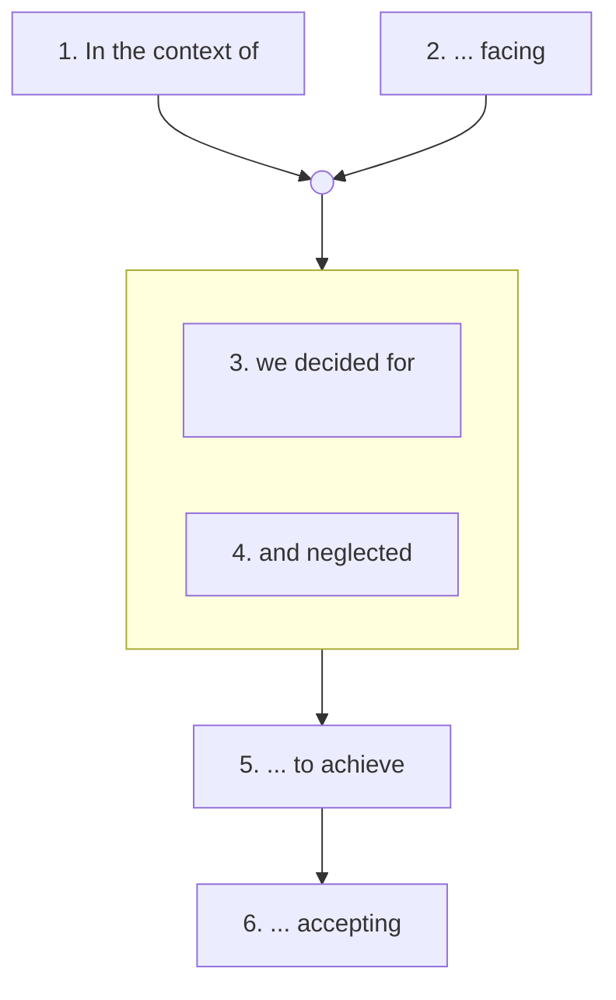

# SPEC-001-A: WH(Y) Statement Format

| Field | Value |
|-------|-------|
| **Specification ID** | SPEC-001-A |
| **Parent ADR** | [ADR-001](../ADR-001-Enhanced-ADR-Format.md) |
| **Version** | 1.0 |
| **Status** | Draft |
| **Last Updated** | 2026-01-08 |

---

## Overview

This specification defines the WH(Y) statement format for architecture decision records in the enhanced ADR mode. The format provides a structured, single-sentence decision statement that captures context, rationale, and trade-offs.

---

## WH(Y) Statement Structure

The WH(Y) statement is a structured sentence with six required elements:

```
In the context of <context>,
facing <non-functional concern>,
we decided for <decision>,
and neglected <alternatives>,
to achieve <benefits>,
accepting that <trade-offs>.
```

### Visual Representation



---

## Element Definitions

### 1. Context (`In the context of...`)

**Purpose:** Establishes the functional scope of the decision.

**Contains:**
- User story or use case reference
- Architecture component (product, solution, system)
- Bounded context or domain

**Examples:**
- "In the context of the customer authentication service..."
- "In the context of processing real-time payment transactions..."
- "In the context of the mobile application's offline mode..."

**Implementation:**
```yaml
why_format:
  context:
    required: true
    max_length: 200
    prompt: "What is the functional context or component this decision applies to?"
```

---

### 2. Facing (`facing...`)

**Purpose:** Identifies the non-functional requirement or quality attribute driving the decision.

**Contains:**
- Quality attribute (performance, security, scalability, etc.)
- Constraint or limitation
- Risk or challenge to address

**Examples:**
- "facing the need for sub-100ms response times at 10,000 concurrent users..."
- "facing regulatory requirements for data residency in the EU..."
- "facing the challenge of maintaining consistency across distributed nodes..."

**Implementation:**
```yaml
why_format:
  facing:
    required: true
    max_length: 250
    prompt: "What non-functional requirement or challenge is driving this decision?"
    suggested_categories:
      - Performance
      - Security
      - Scalability
      - Reliability
      - Maintainability
      - Cost
      - Compliance
```

---

### 3. Decision (`we decided for...`)

**Purpose:** States the chosen option clearly and unambiguously.

**Contains:**
- The selected technology, pattern, approach, or standard
- Specific and actionable statement

**Examples:**
- "we decided for PostgreSQL with read replicas..."
- "we decided for the Saga pattern with choreography..."
- "we decided for a monorepo structure using Nx..."

**Implementation:**
```yaml
why_format:
  decision:
    required: true
    max_length: 150
    prompt: "What is the decision? Be specific about the chosen option."
```

---

### 4. Neglected Alternatives (`and neglected...`)

**Purpose:** Documents what was considered but not chosen.

**Contains:**
- Alternative options that were evaluated
- Brief indication of why they were rejected (optional here, details in ADR body)

**Examples:**
- "and neglected MySQL, MongoDB, and DynamoDB..."
- "and neglected orchestration-based saga and two-phase commit..."
- "and neglected polyrepo and multi-repo with shared packages..."

**Implementation:**
```yaml
why_format:
  neglected:
    required: true
    min_alternatives: 1
    max_length: 200
    prompt: "What alternatives were considered but not chosen?"
```

---

### 5. Benefits (`to achieve...`)

**Purpose:** States the expected positive outcomes.

**Contains:**
- Quality attributes satisfied
- Business benefits realized
- Requirements met

**Examples:**
- "to achieve ACID compliance, strong query capabilities, and operational familiarity..."
- "to achieve loose coupling, independent service deployment, and failure isolation..."
- "to achieve consistent tooling, atomic cross-project refactoring, and simplified dependency management..."

**Implementation:**
```yaml
why_format:
  benefits:
    required: true
    max_length: 250
    prompt: "What benefits or qualities will this decision achieve?"
```

---

### 6. Trade-offs (`accepting that...`)

**Purpose:** Acknowledges the costs, risks, or limitations accepted.

**Contains:**
- Drawbacks of the chosen option
- Implementation effort or cost
- Risks or technical debt introduced
- Compromises on other quality attributes

**Examples:**
- "accepting that we need to manage connection pooling and may need sharding for extreme scale..."
- "accepting increased complexity in tracking transaction state and eventual consistency delays..."
- "accepting longer initial clone times and the need for build caching infrastructure..."

**Implementation:**
```yaml
why_format:
  trade_offs:
    required: true
    max_length: 300
    prompt: "What trade-offs, costs, or risks are we accepting with this decision?"
```

---

## Complete Example

```markdown
## WH(Y) Decision Statement

**In the context of** the e-commerce platform's order processing service,

**facing** the need to handle 50,000 orders per hour during peak sales events while maintaining data consistency and providing real-time inventory updates,

**we decided for** Apache Kafka as the event streaming platform with exactly-once semantics,

**and neglected** RabbitMQ (limited throughput), Amazon SQS (no exactly-once), and synchronous REST calls (coupling and latency),

**to achieve** horizontal scalability, decoupled service communication, event replay capability, and guaranteed message delivery,

**accepting that** we must manage Kafka cluster operations, train the team on event-driven patterns, and handle eventual consistency in downstream systems.
```

---

## Validation Rules

ADR tooling should validate WH(Y) statements against these rules:

| Rule | Description | Severity |
|------|-------------|----------|
| `WHY-001` | All six elements must be present | Error |
| `WHY-002` | Context must reference a specific component or use case | Warning |
| `WHY-003` | At least one alternative must be documented in "neglected" | Error |
| `WHY-004` | Benefits should map to the concern stated in "facing" | Warning |
| `WHY-005` | Trade-offs should be substantive, not empty acknowledgements | Warning |
| `WHY-006` | Statement should form a grammatically coherent sentence | Info |

---

## Template File

When generating a new ADR in enhanced mode, use this template:

```markdown
# ADR-{ID}: {Title}

| Field | Value |
|-------|-------|
| **Decision ID** | ADR-{ID} |
| **Initiative** | {Initiative} |
| **Proposed By** | {Author} |
| **Date** | {Date} |
| **Status** | Proposed |

---

## WH(Y) Decision Statement

**In the context of** {context},

**facing** {non-functional concern},

**we decided for** {decision},

**and neglected** {alternatives},

**to achieve** {benefits},

**accepting that** {trade-offs}.

---

## Context

{Extended context and background}

## Options Considered

### Option 1: {Selected Option} (Selected)
{Description, pros, cons}

### Option 2: {Alternative} (Rejected)
{Description, pros, cons, why rejected}

## Dependencies

| Relationship | ADR ID | Title | Notes |
|--------------|--------|-------|-------|

## References

| Reference ID | Title | Type | Location |
|--------------|-------|------|----------|

## Governance

| Review Board | Date | Outcome | Action | Review Cadence | Next Review |
|--------------|------|---------|--------|----------------|-------------|

## Status History

| Status | Approver | Date |
|--------|----------|------|
| Proposed | {Author} | {Date} |
```

---

## Source Reference

This specification is based on Olaf Zimmermann's WH(Y) statement template:

- [Sustainable Architectural Design Decisions](https://www.ozimmer.ch/practices/2020/04/27/ArchitectureDecisionMaking.html)

See also: [Recording_Architecture_Decisions_Expanded.md](../Recording_Architecture_Decisions_Expanded.md)
