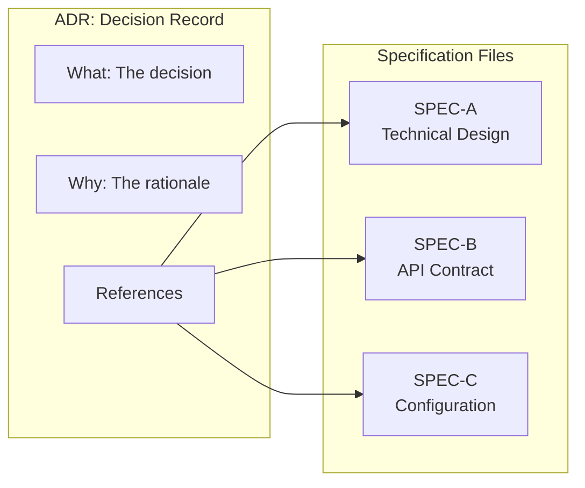

# SPEC-001-B: ADR Minimalism and Separation

| Field | Value |
|-------|-------|
| **Specification ID** | SPEC-001-B |
| **Parent ADR** | [ADR-001](../ADR-001-Enhanced-ADR-Format.md) |
| **Version** | 1.0 |
| **Status** | Draft |
| **Last Updated** | 2026-01-08 |

---

## Overview

This specification defines the principle of ADR minimalism and the separation of architectural decisions from detailed specifications. ADRs should capture the **decision** and its **rationale**, not the implementation details.

---

## Core Principle

> An ADR answers "what did we decide and why?" — it should not attempt to answer "how exactly do we implement this?"

When ADRs become bloated with implementation details, they suffer from:

1. **Maintenance burden** - Implementation details change frequently
2. **Buried rationale** - The decision gets lost in technical noise
3. **Stability problems** - Historical records require constant updates
4. **Audience confusion** - Decision-makers and implementers have different needs

---

## Separation of Concerns



---

## Content Boundaries

### What Belongs in an ADR

| Content Type | Include | Example |
|--------------|---------|---------|
| Decision statement | Yes | "We will use PostgreSQL for operational data" |
| Context and problem | Yes | "We need a database supporting ACID and complex queries" |
| Options considered | Yes | "PostgreSQL, MySQL, MongoDB, DynamoDB" |
| Rejection rationale | Yes | "MongoDB rejected due to consistency requirements" |
| Expected benefits | Yes | "Strong consistency, familiar SQL interface" |
| Accepted trade-offs | Yes | "Requires connection pooling, sharding for scale" |
| Governance metadata | Yes | Status, approvers, review dates |
| References to specs | Yes | Links to detailed specifications |

### What Belongs in a Specification

| Content Type | Exclude from ADR | Belongs In |
|--------------|------------------|------------|
| Database schema | Yes | SPEC-xxx-A: Data Model |
| API contracts | Yes | SPEC-xxx-B: API Specification |
| Configuration templates | Yes | SPEC-xxx-C: Configuration Standard |
| Code examples | Yes | SPEC-xxx-D: Implementation Guide |
| Diagrams (detailed) | Yes | SPEC-xxx-E: Architecture Diagrams |
| Step-by-step procedures | Yes | SPEC-xxx-F: Runbook |
| Security controls | Yes | SPEC-xxx-G: Security Controls |

---

## Stability Comparison

| Concern | ADR | Specification |
|---------|-----|---------------|
| **Stability** | Should rarely change once approved | Expected to evolve with implementation |
| **Audience** | Decision-makers, architects, future teams | Implementers, developers, operators |
| **Versioning** | Immutable record (superseded, not edited) | Living document with version history |
| **Review cycle** | Architecture governance boards | Technical review within teams |
| **Granularity** | One decision per ADR | Multiple specs may support one ADR |

---

## Reference Pattern

### ADR References Section

Include a References section in every ADR linking to supporting specifications:

```markdown
## References

| Reference ID | Title | Type | Location | Version |
|--------------|-------|------|----------|---------|
| SPEC-042-A | API Gateway Configuration | Technical Specification | `/specs/SPEC-042-A.md` | 1.2 |
| SPEC-042-B | Authentication Flow | Design Document | `/specs/SPEC-042-B.md` | 1.0 |
| SPEC-042-C | Rate Limiting Policy | Policy Document | `/policies/rate-limiting.md` | 2.1 |
```

### Specification Types

| Type | Purpose | File Pattern |
|------|---------|--------------|
| Technical Specification | Detailed technical design | `SPEC-{ADR-ID}-{letter}.md` |
| Design Document | Architecture and flow diagrams | `DESIGN-{ADR-ID}-{letter}.md` |
| Policy Document | Governance and operational policies | `POLICY-{name}.md` |
| Configuration Standard | Standard configuration templates | `CONFIG-{name}.md` |
| API Specification | OpenAPI/AsyncAPI definitions | `API-{name}.yaml` |
| Data Model | Schema definitions | `MODEL-{name}.md` |

---

## Implementation Guidance

### Directory Structure

```
project/
├── docs/
│   ├── adr/
│   │   ├── ADR-001-database-selection.md
│   │   ├── ADR-002-api-gateway.md
│   │   └── ...
│   └── specs/
│       ├── SPEC-001-A-database-schema.md
│       ├── SPEC-001-B-connection-pooling.md
│       ├── SPEC-002-A-gateway-config.md
│       └── ...
```

### Automatic Spec Stub Generation

When creating an ADR with `--separate-specs` enabled, tooling should:

1. Create the ADR file with References section
2. Create stub specification files for each referenced spec
3. Link the files bidirectionally

```bash
adr new "Database Selection" --specs="schema,pooling,migration"
```

Generates:
- `adr/ADR-003-database-selection.md`
- `specs/SPEC-003-A-schema.md` (stub)
- `specs/SPEC-003-B-pooling.md` (stub)
- `specs/SPEC-003-C-migration.md` (stub)

### Spec Stub Template

```markdown
# SPEC-{ADR-ID}-{Letter}: {Title}

| Field | Value |
|-------|-------|
| **Specification ID** | SPEC-{ADR-ID}-{Letter} |
| **Parent ADR** | [ADR-{ADR-ID}](../adr/ADR-{ADR-ID}-{slug}.md) |
| **Version** | 0.1 |
| **Status** | Draft |
| **Last Updated** | {Date} |

---

## Overview

{Brief description of what this specification covers}

---

## Specification Details

{Detailed technical content}

---

## Related Specifications

| Spec ID | Title | Relationship |
|---------|-------|--------------|

---

## Changelog

| Version | Date | Author | Changes |
|---------|------|--------|---------|
| 0.1 | {Date} | {Author} | Initial stub |
```

---

## Validation Rules

| Rule | Description | Severity |
|------|-------------|----------|
| `MIN-001` | ADR should not exceed 500 lines | Warning |
| `MIN-002` | Code blocks in ADR should be examples only, not full implementations | Warning |
| `MIN-003` | Detailed diagrams (>20 nodes) should be in specifications | Info |
| `MIN-004` | Configuration snippets >20 lines should be in specifications | Warning |
| `MIN-005` | Every ADR should have at least one referenced specification | Info |

---

## Benefits of Separation

1. **Cleaner decision records** - ADRs remain focused on rationale
2. **Independent evolution** - Specs can update without changing ADR
3. **Right audience** - Different documents for different readers
4. **Easier maintenance** - Smaller, focused documents
5. **Better versioning** - Clear distinction between decision history and living documentation
6. **Searchability** - Specs can be organized and searched by type

---

## Source Reference

Based on ADR Minimalism principles from:

- [Recording_Architecture_Decisions_Expanded.md](../Recording_Architecture_Decisions_Expanded.md)
