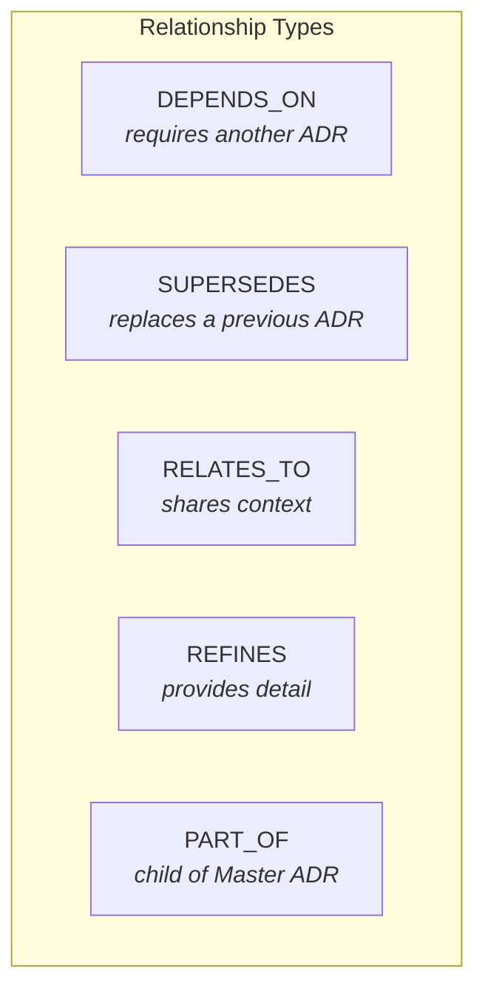
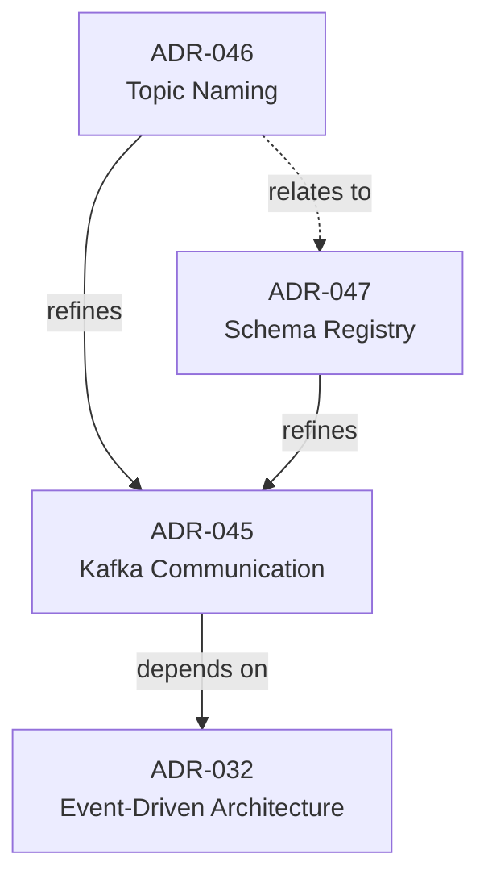

# SPEC-001-C: ADR Dependencies and Relationships

| Field | Value |
|-------|-------|
| **Specification ID** | SPEC-001-C |
| **Parent ADR** | [ADR-001](../ADR-001-Enhanced-ADR-Format.md) |
| **Version** | 1.0 |
| **Status** | Draft |
| **Last Updated** | 2026-01-08 |

---

## Overview

Architecture decisions rarely exist in isolation. This specification defines how to document relationships between ADRs, enabling impact analysis, navigation, and understanding of the broader decision context.

---

## Relationship Types



---

## Relationship Definitions

### DEPENDS_ON

An ADR **depends on** another when it assumes or requires that decision to be in place. The dependent decision cannot be implemented without the prerequisite.

| Property | Value |
|----------|-------|
| Direction | Source depends on Target |
| Implication | Target must be Approved before Source can be implemented |
| Status propagation | If Target is Superseded/Retired, Source must be reviewed |

**Example:**
> "ADR-045: Microservices Communication via Kafka" **depends on** "ADR-032: Event-Driven Architecture Adoption"

**Usage:**
```markdown
| Relationship | ADR ID | Title | Notes |
|--------------|--------|-------|-------|
| Depends On | ADR-032 | Event-Driven Architecture | Prerequisite pattern decision |
```

---

### SUPERSEDES

An ADR **supersedes** another when it replaces a previous decision. The superseded ADR's status changes to "Superseded" with a reference to the new ADR.

| Property | Value |
|----------|-------|
| Direction | Source supersedes (replaces) Target |
| Implication | Target status becomes "Superseded" |
| Status propagation | Any ADR depending on Target should reference Source instead |

**Example:**
> "ADR-051: PostgreSQL for Operational Data" **supersedes** "ADR-018: Oracle Database Standard"

**Usage:**
```markdown
| Relationship | ADR ID | Title | Notes |
|--------------|--------|-------|-------|
| Supersedes | ADR-018 | Oracle Database Standard | Technology refresh |
```

**Automatic Actions:**
1. Update Target ADR status to "Superseded"
2. Add forward reference to Source ADR in Target
3. Notify owners of ADRs that depend on Target

---

### RELATES_TO

ADRs **relate to** each other when they share context, address similar concerns, or should be considered together, but neither strictly depends on the other.

| Property | Value |
|----------|-------|
| Direction | Bidirectional (symmetric) |
| Implication | Changes to one should prompt review of the other |
| Status propagation | Informational only |

**Example:**
> "ADR-033: Container Orchestration with Kubernetes" **relates to** "ADR-034: Service Mesh Implementation"

**Usage:**
```markdown
| Relationship | ADR ID | Title | Notes |
|--------------|--------|-------|-------|
| Relates To | ADR-034 | Service Mesh Implementation | Consider together for networking |
```

---

### REFINES

An ADR **refines** another when it provides more specific guidance within the boundaries of a broader decision.

| Property | Value |
|----------|-------|
| Direction | Source provides detail for Target |
| Implication | Source must be consistent with Target |
| Status propagation | If Target changes, Source must be reviewed |

**Example:**
> "ADR-046: Kafka Topic Naming Convention" **refines** "ADR-045: Microservices Communication via Kafka"

**Usage:**
```markdown
| Relationship | ADR ID | Title | Notes |
|--------------|--------|-------|-------|
| Refines | ADR-045 | Kafka Communication | Naming standards for topics |
```

---

### PART_OF

An ADR is **part of** a Master ADR when it represents one component decision of a larger initiative.

| Property | Value |
|----------|-------|
| Direction | Source is child of Target (Master ADR) |
| Implication | Source contributes to Target's aggregate status |
| Status propagation | Target status derived from Source statuses |

**Example:**
> "ADR-102: Landing Zone Architecture" **is part of** "MADR-001: Cloud Migration Strategy"

**Usage:**
```markdown
| Relationship | ADR ID | Title | Notes |
|--------------|--------|-------|-------|
| Part Of | MADR-001 | Cloud Migration Strategy | Parent initiative |
```

---

## Dependencies Section Template

```markdown
## Dependencies

| Relationship | ADR ID | Title | Notes |
|--------------|--------|-------|-------|
| Depends On | ADR-xxx | {Title} | {Why this dependency exists} |
| Supersedes | ADR-xxx | {Title} | {What changed} |
| Relates To | ADR-xxx | {Title} | {How they relate} |
| Refines | ADR-xxx | {Title} | {What detail this provides} |
| Part Of | MADR-xxx | {Title} | {Parent initiative} |
```

---

## Implementation Guidance

### Dependency Tracking Commands

```bash
# Add dependency when creating ADR
adr new "Kafka Topics" --depends-on=ADR-045

# Add dependency to existing ADR
adr link ADR-046 --depends-on ADR-045

# Supersede an existing ADR
adr supersede ADR-018 --with ADR-051

# View dependencies
adr deps ADR-046

# View impact (what depends on this ADR)
adr impact ADR-045
```

### Dependency Graph Generation

```bash
# Generate Mermaid diagram
adr graph --format=mermaid > adr-dependencies.md

# Generate DOT format for Graphviz
adr graph --format=dot > adr-dependencies.dot

# Interactive HTML view
adr graph --format=html --open
```

**Example Output (Mermaid):**



### Validation Rules

| Rule | Description | Severity |
|------|-------------|----------|
| `DEP-001` | Circular dependencies are not allowed | Error |
| `DEP-002` | Dependencies on Superseded ADRs should be reviewed | Warning |
| `DEP-003` | Dependencies on Rejected ADRs are invalid | Error |
| `DEP-004` | All relationships should have explanatory notes | Info |
| `DEP-005` | PART_OF relationships must reference a Master ADR | Error |

### Impact Analysis

When an ADR status changes, tooling should:

1. **Identify affected ADRs** - All ADRs with DEPENDS_ON or REFINES relationships
2. **Notify stakeholders** - Alert owners of affected ADRs
3. **Generate impact report** - List all downstream decisions

```bash
adr impact ADR-032 --depth=3
```

Output:
```
Impact Analysis for ADR-032: Event-Driven Architecture

Direct Dependencies (depth 1):
  - ADR-045: Kafka Communication (DEPENDS_ON)
  - ADR-048: Event Sourcing Pattern (DEPENDS_ON)

Indirect Dependencies (depth 2):
  - ADR-046: Topic Naming (REFINES ADR-045)
  - ADR-047: Schema Registry (REFINES ADR-045)
  - ADR-049: Event Store Selection (REFINES ADR-048)

Total affected ADRs: 5
```

---

## Data Model

For systems storing ADR metadata:

```yaml
adr_dependency:
  source_adr_id: string      # The ADR defining the relationship
  target_adr_id: string      # The ADR being referenced
  relationship_type: enum    # DEPENDS_ON | SUPERSEDES | RELATES_TO | REFINES | PART_OF
  notes: string              # Explanation of the relationship
  created_at: datetime
  created_by: string
```

---

## Source Reference

Based on ADR Dependencies and Relationships from:

- [Recording_Architecture_Decisions_Expanded.md](../Recording_Architecture_Decisions_Expanded.md)
