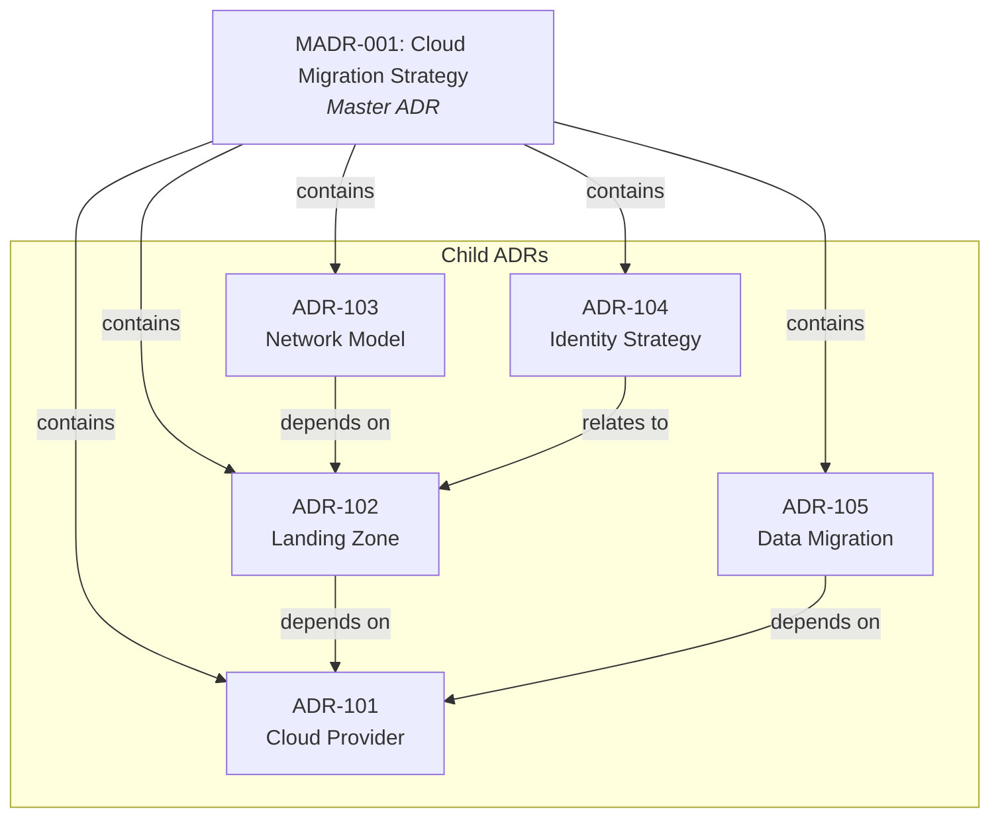
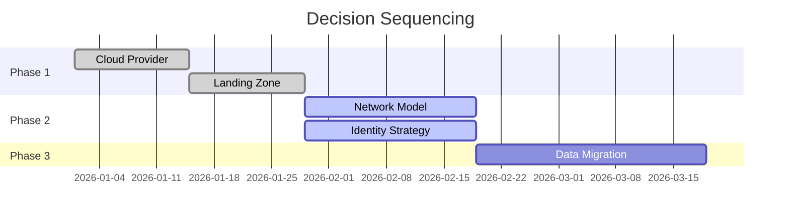

# SPEC-001-D: Master ADRs

| Field | Value |
|-------|-------|
| **Specification ID** | SPEC-001-D |
| **Parent ADR** | [ADR-001](../ADR-001-Enhanced-ADR-Format.md) |
| **Version** | 1.0 |
| **Status** | Draft |
| **Last Updated** | 2026-01-08 |

---

## Overview

A **Master ADR** (also called "Epic ADR" or "Parent ADR") is an overarching decision record that encompasses multiple related child ADRs. It captures the high-level strategic decision while delegating specific implementation decisions to subordinate ADRs.

---

## When to Use Master ADRs

Master ADRs are appropriate when:

| Condition | Example |
|-----------|---------|
| Multiple interdependent decisions | Cloud migration requiring provider, network, identity, and data decisions |
| Single entry point needed | Stakeholders need overview of complete architectural change |
| Multi-team coordination | Initiative spans multiple teams or domains |
| Governance visibility | Major programme requires complete decision landscape |
| Aggregate status tracking | Need to track overall progress while child decisions advance independently |

---

## Master ADR Structure



---

## Master ADR Elements

A Master ADR follows the standard WH(Y) format but includes additional elements:

| Element | Description | Required |
|---------|-------------|----------|
| Strategic Context | The overarching business or technical driver | Yes |
| Scope Boundary | What decisions are in/out of scope | Yes |
| Child ADR Registry | List of all subordinate ADRs with status | Yes |
| Decision Sequencing | Order or phases for child decisions | Recommended |
| Aggregate Status | Overall status derived from children | Auto-calculated |

---

## Child ADR Registry

The registry tracks all subordinate ADRs:

```markdown
## Child ADR Registry

| ADR ID | Title | Status | Phase | Dependencies | Owner |
|--------|-------|--------|-------|--------------|-------|
| ADR-101 | Target Cloud Provider | Approved | 1 | - | Platform Team |
| ADR-102 | Landing Zone Architecture | Approved | 1 | ADR-101 | Platform Team |
| ADR-103 | Network Connectivity Model | Under Review | 2 | ADR-102 | Network Team |
| ADR-104 | Identity & Access Strategy | Under Review | 2 | ADR-102 | Security Team |
| ADR-105 | Data Migration Approach | Proposed | 3 | ADR-101 | Data Team |
```

---

## Decision Sequencing

Define phases or waves for decision-making:

```markdown
## Decision Sequencing

### Phase 1: Foundation (Prerequisites)
- ADR-101: Cloud Provider Selection
- ADR-102: Landing Zone Architecture

### Phase 2: Infrastructure (Parallel)
- ADR-103: Network Connectivity
- ADR-104: Identity & Access

### Phase 3: Migration (After Phase 1 & 2)
- ADR-105: Data Migration Approach
- ADR-106: Application Migration Pattern
```



---

## Aggregate Status Rules

The Master ADR's status is derived from its children:

| Aggregate Status | Condition |
|------------------|-----------|
| **Proposed** | No child ADRs approved yet |
| **In Progress** | At least one child approved, others pending |
| **Approved** | All required child ADRs approved |
| **Partially Implemented** | Some child ADRs implemented |
| **Completed** | All child ADRs implemented or retired |
| **Blocked** | Any child ADR rejected or has unresolved conflict |

### Status Calculation Logic

```python
def calculate_aggregate_status(child_adrs):
    statuses = [adr.status for adr in child_adrs]

    if any(s == 'Rejected' for s in statuses):
        return 'Blocked'
    if all(s in ['Implemented', 'Retired'] for s in statuses):
        return 'Completed'
    if any(s == 'Implemented' for s in statuses):
        return 'Partially Implemented'
    if all(s == 'Approved' for s in statuses):
        return 'Approved'
    if any(s == 'Approved' for s in statuses):
        return 'In Progress'
    return 'Proposed'
```

---

## Master ADR Template

```markdown
# MADR-{ID}: {Strategic Initiative Title}

| Field | Value |
|-------|-------|
| **Decision ID** | MADR-{ID} |
| **Type** | Master ADR |
| **Initiative** | {Programme/Project Name} |
| **Proposed By** | {Author} |
| **Date** | {Date} |
| **Aggregate Status** | {Calculated} |

---

## WH(Y) Decision Statement

**In the context of** {strategic context},

**facing** {overarching challenge or opportunity},

**we decided for** {strategic direction},

**and neglected** {alternative strategies},

**to achieve** {strategic benefits},

**accepting that** {strategic trade-offs and complexity}.

---

## Strategic Context

{Detailed description of the business or technical drivers}

## Scope Boundary

### In Scope
- {Decision area 1}
- {Decision area 2}

### Out of Scope
- {Excluded area 1}
- {Excluded area 2}

---

## Child ADR Registry

| ADR ID | Title | Status | Phase | Dependencies | Owner |
|--------|-------|--------|-------|--------------|-------|
| ADR-xxx | {Title} | {Status} | {Phase} | {Dependencies} | {Team} |

---

## Decision Sequencing

### Phase 1: {Phase Name}
{Description and included ADRs}

### Phase 2: {Phase Name}
{Description and included ADRs}

---

## Aggregate Status History

| Status | Date | Notes |
|--------|------|-------|
| Proposed | {Date} | Initial creation |
| In Progress | {Date} | First child ADR approved |

---

## Governance

| Review Board | Date | Outcome | Next Review |
|--------------|------|---------|-------------|
| {Board} | {Date} | {Outcome} | {Date} |

---

## References

| Reference ID | Title | Type | Location |
|--------------|-------|------|----------|
```

---

## Implementation Guidance

### Creating a Master ADR

```bash
# Create new Master ADR
adr new "Cloud Migration Strategy" --master

# Create child ADR linked to master
adr new "Cloud Provider Selection" --part-of=MADR-001 --phase=1

# Convert existing ADR to Master ADR
adr promote ADR-050 --to-master
```

### Viewing Master ADR Status

```bash
# View aggregate status
adr status MADR-001

# View with child details
adr status MADR-001 --children

# View sequencing
adr sequence MADR-001
```

### Aggregate Status Dashboard

```bash
adr dashboard MADR-001
```

Output:
```
MADR-001: Cloud Migration Strategy
━━━━━━━━━━━━━━━━━━━━━━━━━━━━━━━━━━

Aggregate Status: In Progress (3/5 approved)

Phase 1: Foundation
  [✓] ADR-101: Cloud Provider Selection (Approved)
  [✓] ADR-102: Landing Zone Architecture (Approved)

Phase 2: Infrastructure
  [~] ADR-103: Network Connectivity (Under Review)
  [~] ADR-104: Identity Strategy (Under Review)

Phase 3: Migration
  [ ] ADR-105: Data Migration (Proposed)

Progress: ████████░░░░░░░░ 40%
```

---

## Validation Rules

| Rule | Description | Severity |
|------|-------------|----------|
| `MADR-001` | Master ADR must have at least one child ADR | Warning |
| `MADR-002` | All child ADRs must have PART_OF relationship | Error |
| `MADR-003` | Phase numbers must be sequential | Warning |
| `MADR-004` | Dependencies must respect phase ordering | Warning |
| `MADR-005` | Scope boundary must be defined | Info |

---

## Source Reference

Based on Master ADR concepts from:

- [Recording_Architecture_Decisions_Expanded.md](../Recording_Architecture_Decisions_Expanded.md)
